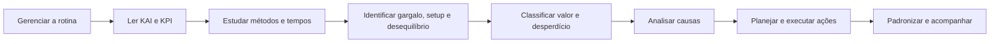

# Rotina e Solução de Problemas

Esta seção conecta a gestão diária ao trabalho de melhoria: primeiro tornar a situação visível, depois compreender o processo, localizar perdas e finalmente aplicar um método de solução.

## Fluxo recomendado

## Notas desta seção

1. [[05 - Rotina e Solução de Problemas/Gerenciamento da Rotina|Gerenciamento da Rotina]]
2. [[05 - Rotina e Solução de Problemas/Indicadores KAI e KPI|Indicadores KAI e KPI]]
3. [[05 - Rotina e Solução de Problemas/Métodos e Tempos|Métodos e Tempos]]
4. [[05 - Rotina e Solução de Problemas/Balanceamento Gargalo e Setup|Balanceamento, Gargalo e Setup]]
5. [[05 - Rotina e Solução de Problemas/Agregação de Valor|Agregação de Valor]]
6. [[05 - Rotina e Solução de Problemas/Kaizen|Kaizen]]
7. [[05 - Rotina e Solução de Problemas/Ferramentas de Solução de Problemas|Ferramentas de Solução de Problemas]]
8. [[05 - Rotina e Solução de Problemas/Metodologia A3|Metodologia A3]]

## Escolha rápida da ferramenta

| Necessidade | Ferramenta inicial |
| --- | --- |
| Entender o desempenho diário | Gestão visual, KAI e KPI |
| Descrever claramente um problema | 5W1H |
| Ir ao local e verificar fatos | 5G |
| Priorizar os poucos problemas vitais | Pareto |
| Organizar causas possíveis | Ishikawa / 6M |
| Aprofundar a cadeia causal | 5 Porquês |
| Organizar um plano de ação | 5W2H |
| Conduzir uma solução completa | A3 / PDCA |

<!-- autoria:start -->

---

**Material desenvolvido e organizado por:** Daniel Vinicius Rios Sismer

- **GitHub:** [github.com/danielsismer](https://github.com/danielsismer)
- **LinkedIn:** [Daniel Vinicius Rios Sismer](https://www.linkedin.com/in/daniel-vinicius-rios-sismer-b434b53b5/)

<!-- autoria:end -->