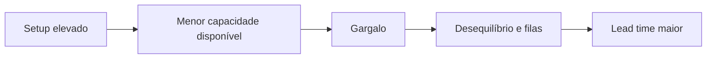

# Balanceamento, Gargalo e Setup

Esses três conceitos ajudam a compreender por que uma linha não entrega a quantidade planejada mesmo quando cada operação parece estar trabalhando.

## Tempos relacionados

| Termo | Definição |
| --- | --- |
| Tempo de ciclo | Tempo necessário para um operador ou equipamento concluir seu ciclo de trabalho antes de repeti-lo. |
| Takt time | Ritmo necessário para atender à demanda do cliente. |
| Lead time | Tempo total para uma unidade atravessar o processo ou fluxo de valor. |
| Tempo de setup | Tempo necessário para preparar o processo para outro produto, lote ou condição. |

## Gargalo

Gargalo é o recurso ou etapa que restringe a capacidade do sistema. Em geral, é o ponto com menor capacidade disponível em relação à demanda ou com maior carga.

Consequências comuns:

- Fila e estoque antes do gargalo.
- Ociosidade ou espera depois dele.
- Atrasos.
- Limitação da produção total.

Melhorar uma etapa que não restringe o fluxo pode gerar eficiência local sem aumentar a saída total.

## Balanceamento de linha

Balancear uma linha é distribuir elementos de trabalho entre postos para aproximar suas cargas do ritmo necessário, respeitando precedência, segurança, ergonomia e recursos.

### Objetivos

- Reduzir ociosidade.
- Evitar sobrecarga.
- Melhorar fluxo.
- Atender ao takt time.
- Dimensionar postos e pessoas.
- Tornar o gargalo visível.

## Setup

Setup é a preparação necessária para mudar de uma condição de produção para outra.

### Tipos no SMED

- Setup interno: atividade que exige o equipamento parado.
- Setup externo: atividade que pode ser feita enquanto o equipamento ainda opera.

O SMED busca separar atividades internas e externas, converter internas em externas quando possível e simplificar ambas.

## Exemplo

Se uma troca leva 40 minutos, mas 15 minutos são gastos procurando ferramentas e levando materiais até a máquina, essas atividades podem ser preparadas externamente. O tempo de máquina parada pode então ser reduzido.

## Relação entre os conceitos

<!-- autoria:start -->

---

**Material desenvolvido e organizado por:** Daniel Vinicius Rios Sismer

- **GitHub:** [github.com/danielsismer](https://github.com/danielsismer)
- **LinkedIn:** [Daniel Vinicius Rios Sismer](https://www.linkedin.com/in/daniel-vinicius-rios-sismer-b434b53b5/)

<!-- autoria:end -->