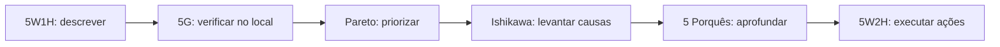

# Ferramentas de Solução de Problemas

As ferramentas abaixo não substituem raciocínio. Cada uma responde a uma pergunta diferente dentro da solução de problemas.

## 5G

Método para compreender problemas com base no local, objeto e fatos reais.

| G | Termo | Uso |
| --- | --- | --- |
| 1 | Genba / Gemba | Ir ao local real. |
| 2 | Genbutsu | Observar o objeto ou condição real. |
| 3 | Genjitsu | Confirmar fatos e dados reais. |
| 4 | Genri | Relacionar o problema aos princípios aplicáveis. |
| 5 | Gensoku | Verificar regras e padrões. |

Os três primeiros formam o princípio 3G; os dois últimos aprofundam a análise.

## 5W1H

Ajuda a descrever um problema com clareza.

- What: o que ocorreu?
- Where: onde?
- When: quando?
- Who: quem ou qual processo está envolvido?
- Why: por que isso é relevante?
- How: como ocorreu ou como foi detectado?

Nesta etapa, `Why` não deve ser usado para declarar uma causa sem evidência.

## Pareto

Gráfico que ordena categorias por frequência, impacto ou custo. Ajuda a concentrar esforço nos problemas mais relevantes.

Passos:

1. Definir o que será medido.
2. Coletar dados comparáveis.
3. Agrupar em categorias.
4. Ordenar do maior para o menor.
5. Calcular percentual acumulado.
6. Priorizar sem ignorar riscos críticos de baixa frequência.

## Ishikawa / causa e efeito

Organiza causas possíveis de um efeito. As categorias industriais clássicas são os 6M:

- Máquina.
- Método.
- Material.
- Mão de obra.
- Medição.
- Meio ambiente.

Algumas organizações acrescentam um sétimo grupo, como dinheiro. O termo `6M1D` anotado na aula parece ser uma adaptação desse modelo; confirme com a professora qual é o significado de `D` adotado na disciplina.

## 5 Porquês

Repete a pergunta "por quê?" para aprofundar a cadeia causal.

Boas práticas:

- Começar por um problema específico.
- Usar fatos, não opiniões.
- Aceitar menos ou mais de cinco perguntas.
- Verificar a causa no processo.
- Não terminar automaticamente em "erro do operador".

## 5W2H

Estrutura um plano de ação:

| Campo | Pergunta |
| --- | --- |
| What | O que será feito? |
| Why | Por que será feito? |
| Where | Onde? |
| When | Quando? |
| Who | Quem é responsável? |
| How | Como será feito? |
| How much | Quanto custará ou quais recursos serão necessários? |

## Sequência sugerida

<!-- autoria:start -->

---

**Material desenvolvido e organizado por:** Daniel Vinicius Rios Sismer

- **GitHub:** [github.com/danielsismer](https://github.com/danielsismer)
- **LinkedIn:** [Daniel Vinicius Rios Sismer](https://www.linkedin.com/in/daniel-vinicius-rios-sismer-b434b53b5/)

<!-- autoria:end -->