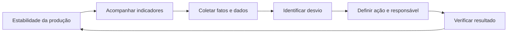

# Gerenciamento da Rotina

Gerenciamento da rotina é o acompanhamento frequente do trabalho para manter estabilidade, tornar desvios visíveis e reagir antes que pequenos problemas se transformem em perdas maiores.

## Objetivos

- Sustentar padrões e estabilidade.
- Comunicar a situação de forma transparente.
- Concentrar a equipe no que realmente importa.
- Criar motivação e senso de equipe.
- Acompanhar indicadores e ações.
- Escalar problemas pela cadeia de ajuda quando necessário.

## Ciclo diário

## Reunião de rotina

O modelo anotado na aula tem estas características:

| Pergunta | Resposta |
| --- | --- |
| Onde? | Em frente ao painel padrão de indicadores, próximo do local de trabalho. |
| Para quê? | Permitir que todos visualizem rapidamente a situação e reajam aos desvios. |
| Frequência | Diária. |
| Duração | Cerca de 5 a 10 minutos. |
| Participantes | Área produtiva, cadeia de ajuda e representantes necessários de segurança e qualidade. |
| Condução | Chefia ou liderança da área produtiva. |

> [!note]
> Frequência, duração e participantes são o modelo apresentado na aula. Cada área pode adaptar a rotina sem perder objetividade, dados confiáveis e definição clara de ações.

## Assuntos prioritários

1. Segurança: ocorrências, riscos, quase acidentes e causas.
2. Qualidade: defeitos, refugos, retrabalho e reclamações.
3. Atendimento: produção realizada, atrasos e cumprimento do plano.
4. Kaizen: melhorias abertas, concluídas e resultados.
5. Pessoas: presença, capacitação e necessidades de apoio.
6. Manutenção: quebras, anomalias e condição dos equipamentos.

## Painel de gestão visual

O painel deve mostrar, sem depender de uma explicação longa:

- Meta.
- Resultado atual.
- Tendência.
- Desvio.
- Causa conhecida ou hipótese em análise.
- Ação, responsável e prazo.
- Situação da ação.

## Cadeia de ajuda

Quando a equipe não consegue resolver um desvio no seu nível, o problema deve subir rapidamente para quem possui conhecimento, autoridade ou recursos. Escalar não significa transferir responsabilidade; significa obter ajuda no tempo necessário.

## Erros comuns

- Transformar a reunião em apresentação longa.
- Ler números sem discutir desvios.
- Registrar ações sem responsável e prazo.
- Atualizar o quadro apenas antes da reunião.
- Esconder problemas para manter indicadores aparentemente bons.
- Misturar problemas complexos com ações imediatas sem abrir uma análise estruturada.

## Relação com WMS

A documentação oficial da WEG informa que o gerenciamento da rotina foi adaptado para produção, escritórios e fornecedores e que uniformiza métricas desde o nível operacional até a alta direção. Consulte [[01 - Visão Geral/Fontes e Referências|Fontes e Referências]].

<!-- autoria:start -->

---

**Material desenvolvido e organizado por:** Daniel Vinicius Rios Sismer

- **GitHub:** [github.com/danielsismer](https://github.com/danielsismer)
- **LinkedIn:** [Daniel Vinicius Rios Sismer](https://www.linkedin.com/in/daniel-vinicius-rios-sismer-b434b53b5/)

<!-- autoria:end -->