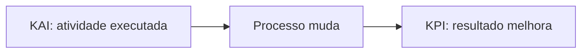

# Indicadores KAI e KPI

KAI e KPI cumprem papéis diferentes e complementares: um acompanha as atividades que podem produzir o resultado; o outro acompanha o desempenho obtido.

## Comparação

| Aspecto | KAI | KPI |
| --- | --- | --- |
| Nome | Key Activity Indicator | Key Performance Indicator |
| Pergunta | Estamos executando as atividades críticas? | Estamos atingindo o resultado esperado? |
| Foco | Ação e comportamento do processo. | Resultado e desempenho. |
| Tendência | Geralmente antecedente ou direcionador. | Frequentemente resultante. |
| Uso | Orientar a rotina e corrigir execução. | Avaliar desempenho e cumprimento de metas. |

## Relação de causa e efeito

Um KAI só é útil quando existe uma relação plausível com um resultado. Medir atividades sem ligação com um KPI cria trabalho de controle sem orientar melhoria.

## Exemplo

Objetivo: reduzir quebras.

- KAI: percentual de inspeções autônomas realizadas corretamente.
- KPI: horas de parada por quebra.

Objetivo: melhorar entrega.

- KAI: percentual de ações do plano de recuperação concluídas no prazo.
- KPI: percentual de ordens entregues no prazo.

## Como definir um bom indicador

- Nome e finalidade claros.
- Fórmula definida.
- Fonte de dados confiável.
- Frequência de coleta.
- Responsável.
- Meta.
- Critério de reação quando houver desvio.
- Relação com o objetivo do processo.

## Atenção à terminologia

`KPI` é uma sigla amplamente padronizada. `KAI` aparece na literatura de TPM e gestão da melhoria como indicador de atividade, mas sua aplicação pode variar entre organizações. No contexto da aula, confirme os exemplos específicos usados pela WEG.

<!-- autoria:start -->

---

**Material desenvolvido e organizado por:** Daniel Vinicius Rios Sismer

- **GitHub:** [github.com/danielsismer](https://github.com/danielsismer)
- **LinkedIn:** [Daniel Vinicius Rios Sismer](https://www.linkedin.com/in/daniel-vinicius-rios-sismer-b434b53b5/)

<!-- autoria:end -->