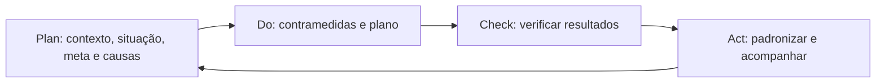

# Metodologia A3

A3 é uma forma estruturada de pensar, comunicar e acompanhar uma solução de problema em uma página. O nome vem do formato de papel A3, mas preencher o formulário não substitui a análise.

## Relação com PDCA

## Estrutura comum

1. Contexto.
2. Situação atual.
3. Problema claramente definido.
4. Meta.
5. Análise de causa raiz.
6. Contramedidas.
7. Plano de implementação.
8. Verificação dos resultados.
9. Padronização e acompanhamento.

## O que torna um A3 útil?

- Problema específico e baseado em fatos.
- Ligação lógica entre causa e contramedida.
- Responsáveis e prazos claros.
- Resultado medido.
- Aprendizado visível.
- Diálogo entre responsável e orientador.

## Tipos anotados na aula

Foram registradas as siglas:

- APS.
- APQ.
- APM.
- APMAE.
- APP.

> [!warning]
> Não encontrei uma fonte pública oficial da WEG que defina essas siglas. Elas foram preservadas como terminologia específica da aula e precisam ser confirmadas antes de receber uma expansão por extenso.

## Erros comuns

- Escolher a solução antes de entender o problema.
- Confundir causa com opinião.
- Criar muitas ações sem priorização.
- Usar o A3 apenas como relatório depois que tudo terminou.
- Não acompanhar se o resultado foi sustentado.

<!-- autoria:start -->

---

**Material desenvolvido e organizado por:** Daniel Vinicius Rios Sismer

- **GitHub:** [github.com/danielsismer](https://github.com/danielsismer)
- **LinkedIn:** [Daniel Vinicius Rios Sismer](https://www.linkedin.com/in/daniel-vinicius-rios-sismer-b434b53b5/)

<!-- autoria:end -->