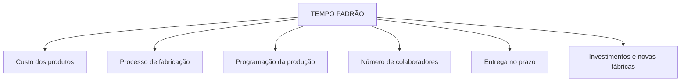

# Métodos e Tempos

O estudo de métodos e tempos analisa como o trabalho é realizado e quanto tempo ele requer. O objetivo não é apenas acelerar a operação, mas construir um método seguro, estável, eficiente e reproduzível.

## Por que o tempo é importante?

## Objetivos do estudo

- Determinar tempos padrão.
- Avaliar ocupação e aproveitamento de máquinas e mão de obra.
- Balancear linhas de produção.
- Calcular o custo de transformação.
- Apoiar planejamento e controle da produção.
- Dimensionar capacidade e necessidade de pessoas.
- Formar uma base de dados para novos produtos, processos e fábricas.

## Estudo de métodos

Antes de medir o tempo, deve-se compreender e melhorar o método:

1. Selecionar a operação.
2. Registrar como o trabalho é realizado.
3. Dividir a operação em elementos observáveis.
4. Questionar sequência, movimentos, layout, ferramentas, ergonomia e segurança.
5. Definir o melhor método conhecido.
6. Padronizar e treinar.
7. Só então estabelecer ou revisar o tempo.

## Cronoanálise

Cronoanálise é a medição direta dos tempos por observação de ciclos com cronômetro.

### Etapas

1. Estudar a operação e dividi-la em elementos.
2. Verificar se o método está padronizado.
3. Observar e cronometrar uma quantidade adequada de ciclos.
4. Tratar variações e ocorrências anormais.
5. Avaliar o ritmo de execução segundo o método adotado pela organização.
6. Calcular o tempo normal.
7. Aplicar tolerâncias justificadas, como necessidades pessoais, fadiga e esperas inevitáveis.
8. Documentar o tempo padrão e as condições em que ele é válido.

> [!important]
> Um tempo sem método, condições e tolerâncias documentadas não é um padrão confiável. A análise também deve respeitar segurança, ergonomia e limites humanos.

## Tempo observado, normal e padrão

- Tempo observado: valor medido durante a execução.
- Tempo normal: tempo observado ajustado pelo ritmo avaliado.
- Tempo padrão: tempo normal acrescido das tolerâncias aplicáveis.

As fórmulas de tolerância variam conforme a convenção adotada pela empresa; por isso, o critério deve estar documentado.

## MTM

MTM significa Methods-Time Measurement. É um sistema de tempos predeterminados: o trabalho manual é descrito por movimentos básicos, e tempos previamente estabelecidos são associados a esses movimentos.

### Diferença principal

| Cronoanálise | MTM |
| --- | --- |
| Mede uma execução observada. | Modela o método a partir de movimentos. |
| Depende de ciclos realizados. | Pode apoiar o planejamento antes da operação existir. |
| Útil para processos em funcionamento. | Útil para projeto e comparação de métodos. |

## Conexões

- [[05 - Rotina e Solução de Problemas/Balanceamento Gargalo e Setup|Balanceamento, Gargalo e Setup]]
- [[05 - Rotina e Solução de Problemas/Agregação de Valor|Agregação de Valor]]
- [[04 - WMS e Excelência Operacional/Sistema de Gestão de Manufatura|Sistema de Gestão de Manufatura]]

<!-- autoria:start -->

---

**Material desenvolvido e organizado por:** Daniel Vinicius Rios Sismer

- **GitHub:** [github.com/danielsismer](https://github.com/danielsismer)
- **LinkedIn:** [Daniel Vinicius Rios Sismer](https://www.linkedin.com/in/daniel-vinicius-rios-sismer-b434b53b5/)

<!-- autoria:end -->